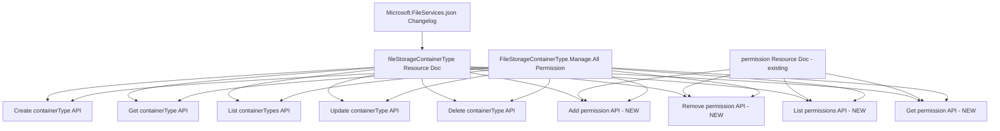

# Documentation Plan: FileStorageContainerType Permissions & Authorization Updates

**Work Item**: [29400](https://dev.azure.com/microsoftgraph/c524a71e-ec9c-42bd-936b-81233fb9baf8/_workitems/edit/29400)  
**API Review**: `Reviews/EnD/13698352-37678-SharePointEmbedded-New-FileStorageContainerTypeManageAll-Update-Description-to-remove-Admin-User-Role/`  
**Workload**: `Microsoft.FileServices`  
**Source docstubs**: `C:\Users\grjoseph\Downloads\drop_build_main\drop_build_main\docStubs`

---

## Change Summary

This branch introduces an **ownership-based authorization model** for SharePoint Embedded Container Types through a new `permissions` navigation property on the `fileStorageContainerType` entity. Key changes:

1. **Updated permission description**: `FileStorageContainerType.Manage.All` no longer requires SPE Admin/Global Admin roles for non-admin users
2. **New navigation property**: `permissions` of type `Collection(oneDrive.permission)` on `fileStorageContainerType` entity
3. **New sub-resource CRUD endpoints**: POST, GET, DELETE on `/containerTypes/{id}/permissions`
4. **Authorization model**: Ownership-based access control with admin bypass and guest user restrictions
5. **Permission JSON updates**: Updated descriptions in `FileStorageContainerType.json`; missing path entries for `/permissions` sub-resource
6. **Changelog**: `Microsoft.FileServices.json` changelog entry for `permissions` relationship addition

---

## New Docstubs Analysis

The generated docstubs at `drop_build_main` provide an updated baseline compared to the workspace `Docstubs/` directory:

### What the new docstubs include
| File | Status | Notes |
|------|--------|-------|
| `beta/resources/filestoragecontainertype.md` | Updated skeleton | Now includes `permissions` relationship row and two new methods in Methods table |
| `beta/api/filestoragecontainertype-post-permissions.md` | New stub | Generic permission POST with many inapplicable properties to trim |
| `beta/api/filestoragecontainertype-list-permissions.md` | New stub | Generic permission GET collection with TODO description |
| `beta/api/filestorage-post-containertypes.md` | Updated stub | Same TODO structure as before |
| `beta/api/filestoragecontainertype-get.md` | Updated stub | Same TODO structure as before |
| `beta/api/filestorage-list-containertypes.md` | Updated stub | Same TODO structure as before |
| `beta/api/filestoragecontainertype-update.md` | Updated stub | Same TODO structure as before |
| `beta/api/filestorage-delete-containertypes.md` | Updated stub | Uses `$ref` in URL which needs fixing |
| `beta/includes/permissions/*.md` | All show "Not supported" | Need pathSets in permissions JSON first |
| `Microsoft.FileServices.json` | Changelog | Contains `permissions` relationship addition entry |

### What is MISSING from new docstubs
| Missing Item | Must be created manually |
|---|---|
| `filestoragecontainertype-delete-permissions.md` | Delete permission API doc - API.md Scenario 7 |
| `filestoragecontainertype-get-permission.md` | Get single permission API doc - API.md Appendix |
| Permission include for delete permission | `filestoragecontainertype-delete-permissions-permissions.md` |
| Permission include for get permission | `filestoragecontainertype-get-permission-permissions.md` |
| Methods table entries for Delete and Get permission | Must be added to resource doc |

### Issues found in new docstubs
| Issue | File | Fix Required |
|---|---|---|
| `$ref` in DELETE endpoint URL | `filestorage-delete-containertypes.md` line 37 | Remove `/$ref` - actual endpoint is `DELETE /.../{id}` |
| All permission includes show "Not supported" | All `*-permissions.md` includes | Update permissions JSON pathSets, then regenerate or manually fix |
| Post-permissions lists many inapplicable properties | `filestoragecontainertype-post-permissions.md` lines 53-66 | Trim to only: `roles`, `grantedToV2` per API.md |
| Generic response objects with unused fields | Both new permission API docs | Replace with realistic responses matching API.md scenarios |

---

## Documentation Artifact Inventory

### Docstubs to Copy + Update (from drop_build_main)

| Source File | Target in Workspace | Action |
|---|---|---|
| `beta/resources/filestoragecontainertype.md` | `Docstubs/generated-fileStorageContainerType/beta/resources/filestoragecontainertype.md` | Copy, then fill all TODOs |
| `beta/api/filestorage-post-containertypes.md` | `Docstubs/generated-fileStorageContainerType/beta/api/filestorage-post-containertypes.md` | Copy, then fill TODOs |
| `beta/api/filestoragecontainertype-get.md` | `Docstubs/generated-fileStorageContainerType/beta/api/filestoragecontainertype-get.md` | Copy, then fill TODOs |
| `beta/api/filestorage-list-containertypes.md` | `Docstubs/generated-fileStorageContainerType/beta/api/filestorage-list-containertypes.md` | Copy, then fill TODOs |
| `beta/api/filestoragecontainertype-update.md` | `Docstubs/generated-fileStorageContainerType/beta/api/filestoragecontainertype-update.md` | Copy, then fill TODOs |
| `beta/api/filestorage-delete-containertypes.md` | `Docstubs/generated-fileStorageContainerType/beta/api/filestorage-delete-containertypes.md` | Copy, fix $ref, fill TODOs |
| `beta/api/filestoragecontainertype-post-permissions.md` | `Docstubs/generated-fileStorageContainerType/beta/api/filestoragecontainertype-post-permissions.md` | Copy, then fill TODOs |
| `beta/api/filestoragecontainertype-list-permissions.md` | `Docstubs/generated-fileStorageContainerType/beta/api/filestoragecontainertype-list-permissions.md` | Copy, then fill TODOs |
| All `beta/includes/permissions/*.md` | `Docstubs/generated-fileStorageContainerType/beta/includes/permissions/` | Copy, then update after permissions JSON fix |
| `Microsoft.FileServices.json` | `Docstubs/generated-fileStorageContainerType/Microsoft.FileServices.json` | Copy as-is |

### New Documentation Files to Create from Scratch

| File to Create | API Scenario | Source |
|---|---|---|
| `filestoragecontainertype-delete-permissions.md` | Remove permission from containerType | API.md Scenario 7 |
| `filestoragecontainertype-get-permission.md` | Get single permission on containerType | API.md Appendix |
| `filestoragecontainertype-delete-permissions-permissions.md` | Permission include for delete | Permissions JSON |
| `filestoragecontainertype-get-permission-permissions.md` | Permission include for get | Permissions JSON |

### Non-Documentation Files Requiring Updates

| File | Action |
|---|---|
| `Permissions/FileStorageContainerType.json` | Add pathSets for POST/GET/DELETE on `/containerTypes/{id}/permissions` and `/containerTypes/{id}/permissions/{permissionId}` |

---

## Architecture: Documentation Structure



---

## Detailed Task Breakdown

### Phase 0: Setup - Copy New Docstubs

#### Task 0: Copy new docstubs into workspace
Copy all files from `C:\Users\grjoseph\Downloads\drop_build_main\drop_build_main\docStubs\beta\` into `Docstubs/generated-fileStorageContainerType/beta/`, replacing older versions. Also copy `Microsoft.FileServices.json` changelog.

### Phase 1: Permissions JSON Update (prerequisite for permission includes)

#### Task 1: Update permissions JSON
**File**: `Permissions/FileStorageContainerType.json`

Add pathSets for:
- `POST /storage/fileStorage/containerTypes/{fileStorageContainerTypeId}/permissions`
- `GET /storage/fileStorage/containerTypes/{fileStorageContainerTypeId}/permissions`
- `GET /storage/fileStorage/containerTypes/{fileStorageContainerTypeId}/permissions/{permissionId}`
- `DELETE /storage/fileStorage/containerTypes/{fileStorageContainerTypeId}/permissions/{permissionId}`

All use `FileStorageContainerType.Manage.All` with `DelegatedWork` scheme only (matching existing pathSets pattern).

### Phase 2: Permission Include Files

#### Task 2: Update and create permission include files
**Directory**: `Docstubs/generated-fileStorageContainerType/beta/includes/permissions/`

**Update** (currently show "Not supported"):
- `filestoragecontainertype-post-permissions-permissions.md` → FileStorageContainerType.Manage.All / DelegatedWork
- `filestoragecontainertype-list-permissions-permissions.md` → FileStorageContainerType.Manage.All / DelegatedWork

**Create new**:
- `filestoragecontainertype-delete-permissions-permissions.md` → FileStorageContainerType.Manage.All / DelegatedWork
- `filestoragecontainertype-get-permission-permissions.md` → FileStorageContainerType.Manage.All / DelegatedWork

Format:
```markdown
|Permission type|Least privileged permission|Higher privileged permissions|
|:---|:---|:---|
|Delegated (work or school account)|FileStorageContainerType.Manage.All|Not available.|
|Delegated (personal Microsoft account)|Not supported.|Not supported.|
|Application|Not supported.|Not supported.|
```

### Phase 3: Resource Documentation

#### Task 3: Update fileStorageContainerType resource doc
**File**: `Docstubs/generated-fileStorageContainerType/beta/resources/filestoragecontainertype.md`

**Changes**:
- Fill metadata: `author` → `grjoseph`, `ms.subservice` → `sharepoint-embedded`
- Replace placeholder description with: Represents a container type in SharePoint Embedded that defines billing, settings, and ownership for file storage containers
- Fill all property descriptions from CSDL and API.md:
  - `billingClassification` → Indicates the billing tier for the container type
  - `billingStatus` → Current billing status. Read-only
  - `createdDateTime` → Date and time the container type was created. Read-only
  - `etag` → Used for optimistic concurrency control during updates. Read-only
  - `expirationDateTime` → Date and time the container type expires. Read-only
  - `id` → Unique identifier for the container type. Read-only
  - `name` → Display name of the container type
  - `owningAppId` → ID of the application that owns this container type. Read-only
  - `settings` → Configuration settings for the container type
- Add methods to Methods table: Delete permission, Get permission (the new stub already has List permissions and Create permission)
- Fill `permissions` relationship description
- Update JSON representation to include `permissions` nav prop
- Add authorization model notes:
  - Two-tier model with application-level and user-level authorization
  - Admin bypass for SPE Admin/Global Admin
  - Guest user restrictions
  - `canDevelopersCreateContainerTypes` feature flag behavior

### Phase 4: Update Existing API Operation Docs

#### Task 4: Update Create fileStorageContainerType API doc
**File**: `Docstubs/.../beta/api/filestorage-post-containertypes.md`
**Source**: API.md Scenario 1

**Key changes**:
- Fill metadata: `author`, `ms.subservice`
- Refine description: creating user is automatically added with `owner` role
- Trim request body properties to only what is accepted: `name` (Required), remove read-only fields
- Note: `$expand=permissions` required to see permissions in response
- Note: Guest users cannot create container types
- Note: Feature flag `canDevelopersCreateContainerTypes` controls non-admin access
- Note: Each application can only own one container type
- Realistic request/response from API.md Scenario 1

#### Task 5: Update Get fileStorageContainerType API doc
**File**: `Docstubs/.../beta/api/filestoragecontainertype-get.md`
**Source**: API.md Scenario 2

**Key changes**:
- Fill metadata
- Ownership-based access: non-admin users can only get container types where they are an owner in permissions
- Document `$expand=permissions` optional query parameter
- SPE/Global Admin bypasses permissions check
- Realistic request/response from API.md Scenario 2

#### Task 6: Update List fileStorageContainerTypes API doc
**File**: `Docstubs/.../beta/api/filestorage-list-containertypes.md`
**Source**: API.md Scenario 3

**Key changes**:
- Fill metadata
- Auto-filters results for non-admin users based on permissions
- SPE/Global Admin sees all container types
- `$expand=permissions` for permissions in response
- Realistic collection response from API.md Scenario 3

#### Task 7: Update Update fileStorageContainerType API doc
**File**: `Docstubs/.../beta/api/filestoragecontainertype-update.md`
**Source**: API.md Scenario 4

**Key changes**:
- Fill metadata
- Requires ownership via permissions property
- `etag` for optimistic concurrency - document `If-Match` header
- Trim updatable properties (only `name` is updatable per API.md)
- Realistic request/response from API.md Scenario 4

#### Task 8: Update Delete fileStorageContainerType API doc
**File**: `Docstubs/.../beta/api/filestorage-delete-containertypes.md`
**Source**: API.md Scenario 5

**Key changes**:
- Fill metadata
- **Fix**: Remove `/$ref` from endpoint URL (line 37) - should be `DELETE /storage/fileStorage/containerTypes/{fileStorageContainerTypeId}`
- Requires ownership via permissions property
- All containers in tenant must be deleted first, including from recycle bin
- Returns `204 No Content`

### Phase 5: Fill In / Create New Permission Sub-Resource API Docs

#### Task 9: Fill in Add permission API doc
**File**: `Docstubs/.../beta/api/filestoragecontainertype-post-permissions.md`
**Source**: API.md Scenario 6

**Key changes**:
- Fill metadata: `author`, `ms.subservice`
- Replace description: Add an owner permission to a container type
- **Trim request body properties** to only applicable ones: `roles` (required, only `owner` supported), `grantedToV2` (required, user identity)
- Remove inapplicable properties: `expirationDateTime`, `grantedTo`, `grantedToIdentities`, `grantedToIdentitiesV2`, `hasPassword`, `inheritedFrom`, `invitation`, `link`, `shareId`
- Max 3 permissions per container type
- Duplicate permissions silently ignored (idempotent)
- Only owners or SPE/Global Admins can add permissions
- Realistic request/response from API.md Scenario 6

#### Task 10: Fill in List permissions API doc
**File**: `Docstubs/.../beta/api/filestoragecontainertype-list-permissions.md`
**Source**: API.md Appendix

**Key changes**:
- Fill metadata
- Replace TODO description: Get a list of permissions on a container type
- Only accessible by owners or admins
- Realistic collection response with `grantedToV2` user identities and `owner` roles

#### Task 11: Create Delete permission API doc
**File**: `Docstubs/.../beta/api/filestoragecontainertype-delete-permissions.md` (NEW)
**Source**: API.md Scenario 7

**Key content**:
- `DELETE /storage/fileStorage/containerTypes/{fileStorageContainerTypeId}/permissions/{permissionId}`
- Owners can remove their own permission (self-removal allowed)
- Non-existent permission returns `404 Not Found`
- Permissionless container types are allowed
- Returns `204 No Content`
- Permission include reference

#### Task 12: Create Get permission API doc
**File**: `Docstubs/.../beta/api/filestoragecontainertype-get-permission.md` (NEW)
**Source**: API.md Appendix

**Key content**:
- `GET /storage/fileStorage/containerTypes/{fileStorageContainerTypeId}/permissions/{permissionId}`
- Returns single permission object
- Only accessible by owners or admins
- Realistic response with `grantedToV2` user identity and `owner` role
- Permission include reference

### Phase 6: Changelog

#### Task 13: Copy changelog file
Copy `Microsoft.FileServices.json` to `Docstubs/generated-fileStorageContainerType/Microsoft.FileServices.json`

---

## Execution Order

The recommended execution order prioritizes dependencies:

1. **Phase 0**: Copy new docstubs into workspace
2. **Phase 1**: Permissions JSON update — prerequisite for permission include files
3. **Phase 2**: Permission include files — referenced by API docs
4. **Phase 3**: Resource doc update — foundation for all API docs
5. **Phase 4**: Existing API doc updates — Tasks 4-8
6. **Phase 5**: New permission sub-resource API docs — Tasks 9-12
7. **Phase 6**: Changelog copy — Task 13

---

## Source Material Cross-Reference

| API.md Section | Target Doc File | Stub Source |
|---|---|---|
| Scenario 1: Create | `filestorage-post-containertypes.md` | drop_build_main stub |
| Scenario 2: Get | `filestoragecontainertype-get.md` | drop_build_main stub |
| Scenario 3: List | `filestorage-list-containertypes.md` | drop_build_main stub |
| Scenario 4: Update | `filestoragecontainertype-update.md` | drop_build_main stub |
| Scenario 5: Delete | `filestorage-delete-containertypes.md` | drop_build_main stub (fix $ref) |
| Scenario 6: Add Permission | `filestoragecontainertype-post-permissions.md` | drop_build_main stub (trim props) |
| Scenario 7: Remove Permission | `filestoragecontainertype-delete-permissions.md` | **Create from scratch** |
| Error Conditions 1-10 | `filestoragecontainertype.md` resource doc + individual API docs | API.md |
| Appendix: Management Operations | `filestoragecontainertype-list-permissions.md` | drop_build_main stub |
| Appendix: Management Operations | `filestoragecontainertype-get-permission.md` | **Create from scratch** |
| Appendix: Authorization Model | `filestoragecontainertype.md` resource doc | API.md |
